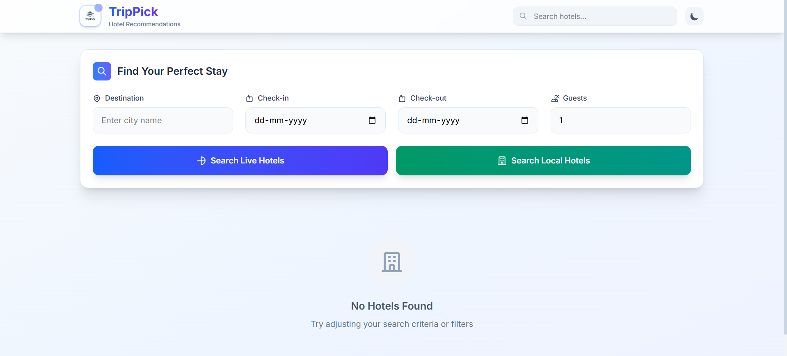
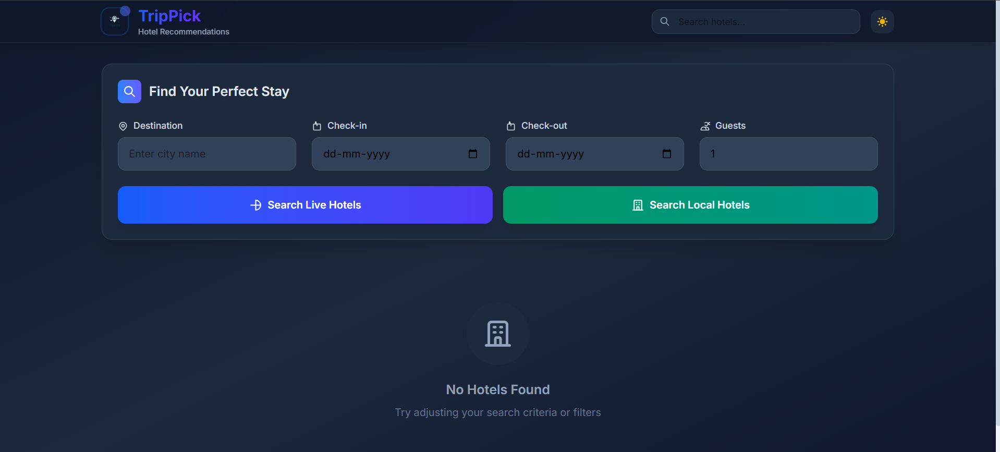
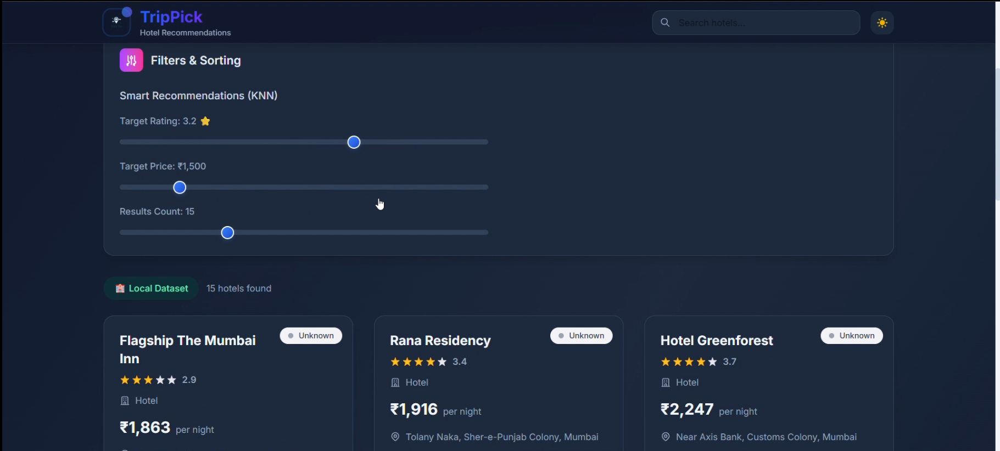
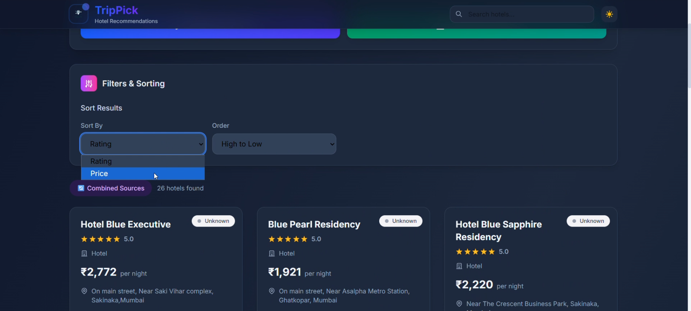
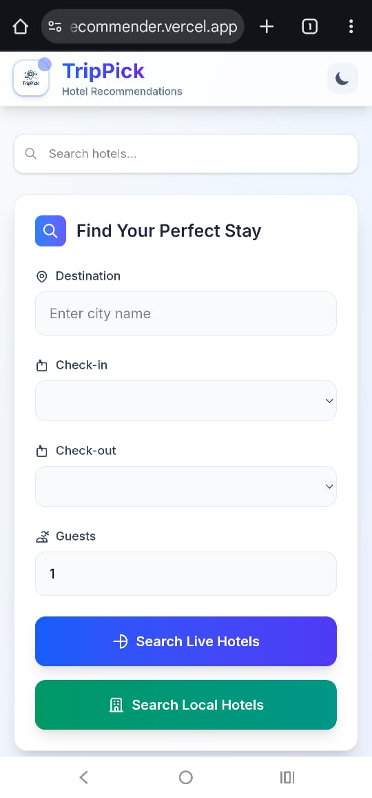
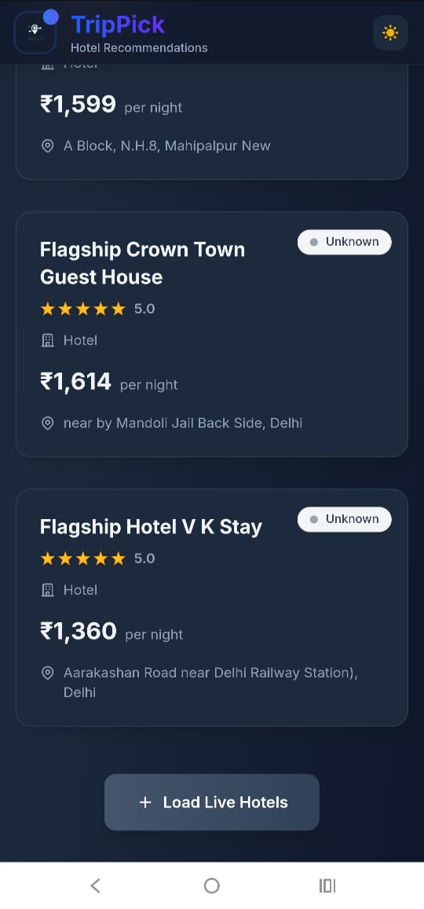

# TripPick – Hotel Recommender System

## 📌 Overview

**TripPick** is a hotel recommender system that helps users find the best hotels based on city selection, live API data, and local datasets.  
The system integrates **Flask** (backend) and **React** (frontend) for a seamless user experience, deployed on **Render** and **Vercel**.

---

## 🌐 Live Demo

🔗 **Live Frontend:** [https://hotel-recommender.vercel.app](https://hotel-recommender.vercel.app)  
🔗 **Live Backend Base URL:** [https://hotel-recommender-ab5b.onrender.com](https://hotel-recommender-ab5b.onrender.com)

---

## ✨ Features

- 🌗 **Light Mode & Dark Mode** UI themes.
- 🔍 **City-based Search** for hotels.
- 🗃️ **Local Dataset Filter** for quick static results.
- 🌐 **API Fetch Filter** using **Amadeus API** for live recommendations.
- 📱 **Mobile‑Responsive Layout** with adaptive design.
- 🛠️ **CORS-enabled backend** to allow secure cross-domain API calls.
- ☁️ Cloud hosting with **Render** (backend) & **Vercel** (frontend).

---

## 🖼️ Screenshots Demo

| Light Mode                                | Dark Mode                               |
| ----------------------------------------- | --------------------------------------- |
|  |  |

| Local/Static Filter                           | API Fetch Filter                          |
| --------------------------------------------- | ----------------------------------------- |
|  |  |

| Mobile View 1                        | Mobile View 2                        |
| ------------------------------------ | ------------------------------------ |
|  |  |

---

## 🛠️ Technology Stack

**Frontend:** React, JavaScript, CSS  
**Backend:** Python, Flask, Flask‑CORS, Pandas, scikit-learn, Gunicorn  
**APIs:** Amadeus API  
**Deployment:** Render (backend), Vercel (frontend)  
**Data Source:** OYO_HOTELS_792_transformed.csv (static) + Live Amadeus API results

---

## ⚙️ Setup & Installation

### 1️⃣ Backend (Flask API)

1. Clone the repository:
   git clone https://github.com/ShamanthJoshi123/hotel-recommender.git
   cd hotel-recommender/backend

2. Create a virtual environment:
   python -m venv venv
   source venv/bin/activate # On Windows: venv\Scripts\activate

3. Install dependencies:
   pip install -r requirements.txt

4. Set your Amadeus API credentials:
   export AMADEUS_API_KEY=your_api_key
   export AMADEUS_API_SECRET=your_api_secret
   (On Windows PowerShell: `setx AMADEUS_API_KEY "your_api_key"`)

5. Run locally:
   flask run

---

### 2️⃣ Frontend (React App)

1. Navigate to frontend folder:
   cd ../frontend

2. Install dependencies:
   npm install

3. Run locally:
   npm start
   This opens `http://localhost:3000` in your browser.

---

## 🌐 Deployment

### Backend on Render

- **Build Command:**
  pip install -r requirements.txt
- **Start Command:**
  gunicorn app:app --bind 0.0.0.0:$PORT
- **CORS Config Example:**
  from flask_cors import CORS
  CORS(app, origins=["https://hotel-recommender.vercel.app"])

### Frontend on Vercel

- Connect your GitHub repo to Vercel.
- Ensure `.env` file contains:
  REACT_APP_API_BASE_URL=https://hotel-recommender-ab5b.onrender.com
- Deploy and test from:
  https://hotel-recommender.vercel.app

---

## 📡 API Endpoints

**Base URL:** `https://hotel-recommender-ab5b.onrender.com`

| Method | Endpoint          | Description                               |
| ------ | ----------------- | ----------------------------------------- |
| GET    | `/oyo_hotels`     | Returns static OYO hotel dataset          |
| GET    | `/live_recommend` | Returns live recommendations from Amadeus |

---

## 🧊 Cold Start Note

- On Render's free tier, your backend will sleep after ~15 minutes of inactivity.
- First request after idle will be slow (cold start) — may take 30–60 seconds.
- You can prevent this with a paid plan or a scheduled “keep-alive” ping service.

---

## 📬 Contact

Created by **Shamanth Joshi** – [shamanthjoshi2004@gmail.com](mailto:shamanthjoshi2004@gmail.com)
